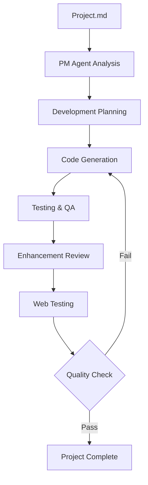

<div align="center">
  
  
  # AI Dev Team Agent
  
  **Automated Development Workflow powered by Specialized AI Agents**
  
  [](https://opensource.org/licenses/MIT)
  [](https://marketplace.visualstudio.com/vscode)
  [](https://www.typescriptlang.org/)  [](https://github.com/Hyoni1129/vscode-ai-dev-agent/issues)
  [](https://github.com/Hyoni1129/vscode-ai-dev-agent/stargazers)
</div>

---

## 🚀 Overview

AI Dev Team Agent is an intelligent VS Code extension that revolutionizes development workflows by simulating a complete development team using specialized AI agents. Transform your development process with automated project management, intelligent code generation, comprehensive testing, and continuous improvement cycles.

### ✨ Key Features

- **🎯 Project Management Agent (PM)**: Analyzes requirements, creates project structures, and coordinates workflows
- **👨‍💻 Development Agent (Dev)**: Implements features, fixes bugs, and handles code development with best practices
- **🧪 Code Tester Agent**: Performs comprehensive code analysis, runs tests, and identifies quality issues
- **🔧 Enhancement Agent**: Reviews and improves code based on feedback and industry standards
- **🌐 Web Tester Agent**: Conducts web-specific testing including cross-browser compatibility with Playwright
- **💬 Integrated Chat Interface**: Seamless interaction through VS Code's chat interface

### 🎥 Demo


---

## 📋 Table of Contents

- [Installation](#-installation)
- [Quick Start](#-quick-start)
- [Features](#-features)
- [Commands](#-commands)
- [Configuration](#-configuration)
- [Examples](#-examples)
- [Contributing](#-contributing)
- [License](#-license)
- [Support](#-support)

---

## 🛠 Installation

### Prerequisites

- **VS Code**: Version 1.85.0 or higher
- **GitHub Copilot**: For LLM access (recommended)
- **Node.js**: For JavaScript/TypeScript projects
- **Internet Connection**: For AI model access

### Install from VS Code Marketplace

1. Open VS Code
2. Go to Extensions (Ctrl+Shift+X / Cmd+Shift+X)
3. Search for "AI Dev Team Agent"
4. Click "Install"

### Install from VSIX (Development)

1. Download the latest `.vsix` file from [Releases](https://github.com/Hyoni1129/vscode-ai-dev-agent/releases)
2. Open VS Code
3. Run command: `Extensions: Install from VSIX...`
4. Select the downloaded `.vsix` file

---

## 🚀 Quick Start

### 1. Create Your Project Description

Create a `Project.md` file in your workspace root:

```markdown
# My Task Manager App

## Description
A modern task management web application with CRUD operations and real-time updates.

## Requirements
- React.js with TypeScript
- Modern responsive design
- Local storage for persistence
- Cross-browser compatibility

## Features
- ✅ Add, edit, delete tasks
- ✅ Mark tasks as complete/incomplete
- ✅ Filter tasks by status
- ✅ Search functionality
- ✅ Dark/light theme toggle
```

### 2. Start the Automated Workflow

Open VS Code Chat (Ctrl+Alt+I / Cmd+Alt+I) and type:

```
@ai-dev-team /start
```

### 3. Monitor Progress

```
@ai-dev-team /status
```

The system will automatically:
1. **Analyze** your project requirements
2. **Plan** the development strategy
3. **Generate** project structure and code
4. **Test** the implementation
5. **Enhance** based on best practices
6. **Iterate** until completion

---

## 🎯 Features

### 🤖 AI Agent System

| Agent | Role | Capabilities |
|-------|------|-------------|
| **PM Agent** | Project Manager | • Requirements analysis<br>• Task breakdown<br>• Workflow coordination |
| **Dev Agent** | Developer | • Code implementation<br>• Bug fixes<br>• Feature development |
| **Code Tester** | QA Engineer | • Unit testing<br>• Code quality analysis<br>• Performance optimization |
| **Enhancement Agent** | Senior Developer | • Code review<br>• Best practices implementation<br>• Architecture improvements |
| **Web Tester** | Test Engineer | • Cross-browser testing<br>• UI/UX validation<br>• Accessibility checks |

### 🔄 Automated Workflow



---

## 📝 Commands

| Command | Description | Usage |
|---------|-------------|-------|
| `/start` | Initialize and begin automated development workflow | `@ai-dev-team /start` |
| `/status` | Check current workflow status and progress | `@ai-dev-team /status` |
| `/resume` | Resume interrupted workflow from last checkpoint | `@ai-dev-team /resume` |
| `/reset` | Reset workflow state and start fresh | `@ai-dev-team /reset` |

---

## ⚙️ Configuration

Configure the extension through VS Code settings:

```json
{
  "aiDevTeam.defaultModel": "copilot-gpt-4",
  "aiDevTeam.enableWebTesting": true,
  "aiDevTeam.maxTokensPerRequest": 4000
}
```

### Available Settings

- **`aiDevTeam.defaultModel`**: Default LLM model for agents
- **`aiDevTeam.enableWebTesting`**: Enable/disable web testing with Playwright
- **`aiDevTeam.maxTokensPerRequest`**: Maximum tokens per LLM request

---

## 📚 Examples

### Web Application Example

```markdown
# E-commerce Store

## Description
A full-featured e-commerce platform with user authentication and payment processing.

## Tech Stack
- Frontend: Next.js, TailwindCSS
- Backend: Node.js, Express
- Database: MongoDB
- Authentication: JWT

## Features
- User registration/login
- Product catalog with search
- Shopping cart functionality
- Order management
- Payment integration
```

### API Service Example

```markdown
# REST API Service

## Description
A scalable REST API for managing user data with authentication and rate limiting.

## Requirements
- Node.js with Express
- PostgreSQL database
- Redis for caching
- JWT authentication
- API documentation

## Endpoints
- POST /auth/login
- GET /users
- PUT /users/:id
- DELETE /users/:id
```

More examples available in the [`examples/`](examples/) directory.

---

## 🤝 Contributing

We welcome contributions! Please see our [Contributing Guide](CONTRIBUTING.md) for details.

### Development Setup

```bash
# Clone the repository
git clone https://github.com/Hyoni1129/vscode-ai-dev-agent.git
cd vscode-ai-dev-agent

# Install dependencies
npm install

# Compile the extension
npm run compile

# Run in development mode
# Press F5 to launch Extension Development Host
```

### Code of Conduct

This project follows the [Contributor Covenant Code of Conduct](CODE_OF_CONDUCT.md).

---

## 📄 License

This project is licensed under the MIT License - see the [LICENSE](LICENSE) file for details.

---

## 🆘 Support

### Documentation

- [User Guide](docs/guides/user-guide.md)
- [API Documentation](docs/api/README.md)
- [Development Guide](docs/DEVELOPMENT.md)

### Community

- 🐛 [Report Issues](https://github.com/Hyoni1129/vscode-ai-dev-agent/issues)
- 💡 [Feature Requests](https://github.com/Hyoni1129/vscode-ai-dev-agent/issues/new?template=feature_request.md)
- 💬 [Discussions](https://github.com/Hyoni1129/vscode-ai-dev-agent/discussions)


### 👨‍💻 Developer

**JeongHan Lee**
- Email: Team.Stella.Global@gmail.com
---

## 🏆 Acknowledgments

- Thanks to the VS Code team for the excellent extension API
- GitHub Copilot for powering our AI capabilities
- The open-source community for inspiration and feedback

---

<div align="center">
  <strong>Made with ❤️ by the AI Dev Team Agent Community</strong>
  
  [⭐ Star us on GitHub](https://github.com/Hyoni1129/vscode-ai-dev-agent) | [📝 Documentation](docs/) | [🚀 Get Started](#-quick-start)
</div>
