# 🤖 AI Dev Team Agent

<div align="center">
  
  
  **Automated Development Workflow Powered by AI Agents**
  
  [](https://github.com/yourusername/ai-dev-team-agent)
  [](LICENSE)
  [](https://code.visualstudio.com/)
  [](https://www.typescriptlang.org/)
</div>

---

## 🚀 Overview

AI Dev Team Agent is a revolutionary VS Code extension that automates the entire software development workflow using specialized AI agents. From project planning to code generation, testing, and enhancement - let AI handle the heavy lifting while you focus on the big picture.

### ✨ Key Features

- 🎯 **Fully Automated Workflow** - Complete project generation from a simple description
- 🧠 **Multi-Agent System** - Specialized AI agents for different development phases
- 💬 **Chat Interface** - Easy interaction through VS Code's chat participant API
- 📊 **Real-time Progress** - Visual progress tracking with detailed status updates
- 🔄 **State Persistence** - Resume workflows after VS Code restarts
- 🛡️ **Error Recovery** - Robust error handling with automatic retries
- 📁 **Multi-format Support** - HTML, CSS, JavaScript, TypeScript, and more

---

## 🎬 Demo

> **Coming Soon**: Video demonstration of the AI Dev Team Agent in action

---

## 🏗️ Architecture

The extension implements a sophisticated multi-agent system with the following specialized agents:

```mermaid
graph TD
    A[👤 User] -->|Project.md| B[💬 Chat Interface]
    B --> C[🎯 Project Manager Agent]
    C --> D[👨‍💻 Developer Agent]
    D --> E[🔍 Code Tester Agent]
    E --> F[🌐 Web Tester Agent]
    F --> G[✨ Enhancement Agent]
    G --> H[📦 Complete Project]
    
    C -.->|Dev_Checklist.md| D
    E -.->|Code_Tester_Report.md| D
    F -.->|Web_Tester_Report.md| D
    G -.->|Enhancement_Report.md| C
```

<div align="center">



</div>

### 🤖 Agent Responsibilities

| Agent | Role | Responsibilities |
|-------|------|------------------|
| **🎯 Project Manager** | Coordinator | Project planning, task management, workflow orchestration |
| **👨‍💻 Developer** | Code Generator | Feature implementation, bug fixes, code modifications |
| **🔍 Code Tester** | Quality Assurance | Static analysis, error detection, completeness validation |
| **🌐 Web Tester** | Dynamic Testing | Browser automation, user interaction simulation |
| **✨ Enhancement** | UX/UI Specialist | Design improvements, feature suggestions, optimization |

---

## 🚀 Getting Started

### Prerequisites

- **VS Code** version 1.87.0 or higher
- **Node.js** version 18 or higher
- **TypeScript** 5.3.0 or higher

### Installation

#### Option 1: VS Code Marketplace (Coming Soon)
1. Open VS Code
2. Go to Extensions (`Ctrl+Shift+X`)
3. Search for "AI Dev Team Agent"
4. Click "Install"

#### Option 2: Manual Installation
1. Clone this repository:
   ```bash
   git clone https://github.com/yourusername/ai-dev-team-agent.git
   cd ai-dev-team-agent
   ```

2. Install dependencies:
   ```bash
   npm install
   ```

3. Build the extension:
   ```bash
   npm run compile
   ```

4. Launch VS Code and press `F5` to run the extension in a new Extension Development Host window

### Quick Start

1. **Create a Project Description**
   
   Create a `Project.md` file in your workspace root:
   ```markdown
   # Task Manager Web App
   
   Create a simple task management application with the following features:
   
   ## Core Features
   - Add new tasks with a text input
   - Display tasks in a list
   - Mark tasks as completed
   - Delete tasks with a delete button  
   - Save tasks to localStorage
   
   ## Technical Requirements
   - Pure HTML, CSS, and JavaScript
   - Responsive design
   - Modern, clean UI
   ```

2. **Start the AI Development Team**
   
   Open VS Code Chat (`Ctrl+Alt+I`) and type:
   ```
   @ai-dev-team /start
   ```

3. **Monitor Progress**
   
   Check the workflow status anytime:
   ```
   @ai-dev-team /status
   ```

4. **Get Your Complete Project**
   
   The AI team will generate all necessary files and provide a fully functional application!

---

## 💬 Chat Commands

| Command | Description | Example |
|---------|-------------|---------|
| `/start` | Begin automated development workflow | `@ai-dev-team /start` |
| `/status` | Check current workflow status and progress | `@ai-dev-team /status` |
| `/resume` | Resume an interrupted workflow | `@ai-dev-team /resume` |
| `/reset` | Reset workflow state and start fresh | `@ai-dev-team /reset` |

---

## 📋 Workflow Phases

### 1. 🎯 Initial Planning
- Analyzes your `Project.md` requirements
- Creates comprehensive development checklist
- Estimates project scope and timeline

### 2. 👨‍💻 Core Development  
- Generates project structure
- Implements all specified features
- Creates HTML, CSS, JavaScript files
- Handles package.json and dependencies

### 3. 🔍 Code Testing
- Performs static code analysis
- Identifies syntax errors and logical issues
- Validates feature completeness
- Generates detailed test reports

### 4. 🛠️ Bug Fixing
- Reviews test reports
- Automatically fixes identified issues
- Validates fixes before proceeding

### 5. ✨ Enhancement Review
- Analyzes completed project
- Suggests UI/UX improvements
- Recommends additional features
- Provides implementation guidance

### 6. 🚀 Final Implementation
- Applies enhancement suggestions
- Optimizes performance
- Ensures cross-browser compatibility
- Delivers production-ready code

---

## 🛠️ Configuration

Configure the extension through VS Code settings:

```json
{
  "aiDevTeam.defaultModel": "copilot-gpt-4",
  "aiDevTeam.enableWebTesting": true,
  "aiDevTeam.maxRetries": 3,
  "aiDevTeam.tokenOptimization": true
}
```

### Available Settings

| Setting | Description | Default |
|---------|-------------|---------|
| `defaultModel` | LLM model to use for agents | `"copilot-gpt-4"` |
| `enableWebTesting` | Enable Playwright web testing | `true` |
| `maxRetries` | Maximum retry attempts for failed operations | `3` |
| `tokenOptimization` | Enable token usage optimization | `true` |

---

## 📊 Project Examples

### 🎮 Game Development
```markdown
# Snake Game

Create a classic Snake game using HTML5 Canvas and JavaScript.

Features:
- Snake movement with arrow keys
- Food generation and collision detection
- Score tracking
- Game over screen
- Responsive design
```

### 📱 Web Application
```markdown
# Weather Dashboard

Build a weather dashboard that shows current conditions and forecasts.

Features:
- Current weather display
- 5-day forecast
- Location search
- Responsive grid layout
- Dark/light theme toggle
```

### 🛒 E-commerce
```markdown
# Product Catalog

Create a product catalog with shopping cart functionality.

Features:
- Product grid display
- Add to cart functionality
- Cart management
- Responsive design
- Product filtering
```

---

## 🤝 Contributing

We welcome contributions from the community! Here's how you can help:

### Development Setup

1. **Fork the repository**
2. **Clone your fork:**
   ```bash
   git clone https://github.com/yourusername/ai-dev-team-agent.git
   cd ai-dev-team-agent
   ```

3. **Install dependencies:**
   ```bash
   npm install
   ```

4. **Create a feature branch:**
   ```bash
   git checkout -b feature/your-feature-name
   ```

5. **Make your changes and test thoroughly**

6. **Submit a pull request**

### Code Style

- Follow TypeScript best practices
- Use meaningful variable and function names
- Add comprehensive comments for complex logic
- Ensure all tests pass before submitting

### Issues and Bug Reports

Found a bug? Have a feature request? Please create an issue with:

- Clear description of the problem/feature
- Steps to reproduce (for bugs)
- Expected vs actual behavior
- Environment details (VS Code version, OS, etc.)

---

## 📝 License

This project is licensed under the MIT License - see the [LICENSE](LICENSE) file for details.

---

## 🙏 Acknowledgments

- **VS Code Team** - For the excellent extension API
- **OpenAI** - For the powerful language models
- **Playwright Team** - For browser automation capabilities
- **TypeScript Team** - For the robust type system

---
## 👨‍💻 Developer

**JeongHan Lee**
- Email: Team.Stella.Global@gmail.com

---

