<!-- Improved compatibility of back to top link: See: https://github.com/othneildrew/Best-README-Template/pull/73 -->
<a name="readme-top"></a>

<!-- PROJECT SHIELDS -->
<!--
*** I'm using markdown "reference style" links for readability.
*** Reference links are enclosed in brackets [ ] instead of parentheses ( ).
*** See the bottom of this document for the declaration of the reference variables
*** for contributors-url, forks-url, etc. This is an optional, concise syntax you may use.
*** https://www.markdownguide.org/basic-syntax/#reference-style-links
-->

<div align="center">

[![Contributors][contributors-shield]][contributors-url]
[![Forks][forks-shield]][forks-url]
[![Stargazers][stars-shield]][stars-url]
[![Issues][issues-shield]][issues-url]
[![CC BY-NC-SA 4.0 License][license-shield]][license-url]
</div>

<!-- PROJECT LOGO -->
<br />
<div align="center">
  <a href="https://github.com/JeongHanLee/VSCODE_Agent_Extension">
    
  </a>

  <h3 align="center">🤖 AI Dev Team Agent</h3>
  <p align="center">
    <em>Automated Development Workflow Powered by AI Agents</em>
    <br />
    <strong>« Part of the Stella Open Source Project »</strong>
</div>

<!-- TABLE OF CONTENTS -->
<details>
  <summary>Table of Contents</summary>
  <ol>
    <li>
      <a href="#about-the-project">About The Project</a>
      <ul>
        <li><a href="#built-with">Built With</a></li>
      </ul>
    </li>
    <li>
      <a href="#getting-started">Getting Started</a>
      <ul>
        <li><a href="#prerequisites">Prerequisites</a></li>
        <li><a href="#installation">Installation</a></li>
      </ul>
    </li>
    <li><a href="#usage">Usage</a></li>
    <li><a href="#roadmap">Roadmap</a></li>
    <li><a href="#contributing">Contributing</a></li>
    <li><a href="#license">License</a></li>
    <li><a href="#contact">Contact</a></li>
    <li><a href="#acknowledgments">Acknowledgments</a></li>
  </ol>
</details>

<!-- ABOUT THE PROJECT -->
## 🚀 About The Project

> [!WARNING]
> **This project is currently under development** and is not yet ready for production use. Features may be incomplete or unstable.

<div align="center">
  
</div>

<br />

The **AI Dev Team Agent** is a revolutionary VS Code extension that brings the power of collaborative AI development to your fingertips. As part of the **Stella Open Source Project**, this extension represents the cutting edge of automated software development, featuring a sophisticated multi-agent system that can handle everything from initial planning to final deployment.

### ✨ What makes this special?

🎯 **Fully Automated Workflow** — Transform a simple project description into a complete, production-ready application<br>
🧠 **Multi-Agent Architecture** — Specialized AI agents work together like a real development team<br>
💬 **Seamless Integration** — Native VS Code chat interface for effortless interaction<br>
📊 **Real-time Monitoring** — Visual progress tracking with detailed status updates<br>
🔄 **Persistent State** — Resume workflows even after VS Code restarts<br>
🛡️ **Intelligent Recovery** — Advanced error handling with automatic retry mechanisms<br>
📁 **Universal Support** — Works with HTML, CSS, JavaScript, TypeScript, and beyond

### 🏗️ Multi-Agent System Architecture

```mermaid
graph TB
    subgraph "Stella AI Dev Team Agent"
        A[👤 User] -->|Project.md| B[💬 Chat Interface]
        B --> C[🎯 PM Agent<br/>Project Manager]
        C --> D[👨‍💻 DEV Agent<br/>Developer]
        D --> E[🔍 Code Tester<br/>Quality Assurance]
        E --> F[🌐 Web Tester<br/>Dynamic Testing]
        F --> G[✨ Enhancement Agent<br/>UX/UI Specialist]
        G --> H[📦 Complete Project]
        
        C -.->|Dev_Checklist.md| D
        E -.->|Code_Tester_Report.md| D
        F -.->|Web_Tester_Report.md| D
        G -.->|Enhancement_Report.md| C
        
        style A fill:#e1f5fe
        style B fill:#f3e5f5
        style C fill:#fff3e0
        style D fill:#e8f5e8
        style E fill:#fff8e1
        style F fill:#e3f2fd
        style G fill:#fce4ec
        style H fill:#f1f8e9
    end
```

<div align="center">



</div>

<p align="right">(<a href="#readme-top">back to top</a>)</p>

### �️ Built With

This project leverages cutting-edge technologies and frameworks:

* [![TypeScript][TypeScript.js]][TypeScript-url]
* [![Node.js][Node.js]][Node-url]
* [![VS Code][VSCode.js]][VSCode-url]
* [![Playwright][Playwright.js]][Playwright-url]
* [![OpenAI][OpenAI.js]][OpenAI-url]
* [![GitHub Copilot][Copilot.js]][Copilot-url]
* [![Webpack][Webpack.js]][Webpack-url]
* [![ESLint][ESLint.js]][ESLint-url]

<p align="right">(<a href="#readme-top">back to top</a>)</p>

<!-- GETTING STARTED -->
## 🎬 Getting Started

### Prerequisites

Before you begin, ensure you have the following installed:

* **VS Code** version 1.87.0 or higher
  ```sh
  # Check your VS Code version
  code --version
  ```

* **Node.js** version 18 or higher
  ```sh
  # Check your Node.js version
  node --version
  ```

* **npm** (comes with Node.js)
  ```sh
  # Check your npm version
  npm --version
  ```

### Installation

#### Option 1: VS Code Marketplace (Coming Soon)
```
1. Open VS Code
2. Go to Extensions (Ctrl+Shift+X)
3. Search for "AI Dev Team Agent"
4. Click "Install"
```

#### Option 2: Development Installation

1. **Clone the repository**
   ```sh
   git clone https://github.com/JeongHanLee/VSCODE_Agent_Extension.git
   cd VSCODE_Agent_Extension
   ```

2. **Install dependencies**
   ```sh
   npm install
   ```

3. **Build the extension**
   ```sh
   npm run compile
   ```

4. **Launch VS Code**
   ```sh
   code .
   ```

5. **Run the extension**
   - Press `F5` to open a new Extension Development Host window
   - The extension will automatically activate

<p align="right">(<a href="#readme-top">back to top</a>)</p>

<!-- USAGE EXAMPLES -->
## 💡 Usage

### Quick Start Guide

1. **Create Your Project Vision**
   
   Create a `Project.md` file in your workspace root:
   ```markdown
   # 🎮 Snake Game
   
   Create a classic Snake game using HTML5 Canvas and JavaScript.
   
   ## 🎯 Core Features
   - Snake movement with WASD/Arrow keys
   - Food generation and collision detection
   - Score tracking and high score system
   - Game over screen with restart option
   - Responsive design for all screen sizes
   
   ## 🎨 Design Requirements
   - Modern, clean UI with dark theme
   - Smooth animations and transitions
   - Mobile-friendly controls
   - Neon-style graphics
   ```

2. **Activate the AI Team**
   
   Open VS Code Chat (`Ctrl+Alt+I`) and type:
   ```
   @ai-dev-team /start
   ```

3. **Monitor the Magic**
   
   Watch as your AI development team:
   - 📋 Creates a detailed development plan
   - 💻 Writes all the code
   - 🔍 Tests and debugs automatically
   - ✨ Enhances the final product

4. **Check Progress Anytime**
   ```
   @ai-dev-team /status
   ```

### 🎮 Agent Roles & Responsibilities

<div align="center">

| Agent | Role | Key Responsibilities |
|-------|------|---------------------|
| **🎯 PM Agent** | Project Coordinator | Project planning, task management, workflow orchestration |
| **👨‍💻 DEV Agent** | Code Generator | Feature implementation, bug fixes, code optimization |
| **🔍 Code Tester** | Quality Assurance | Static analysis, error detection, code validation |
| **🌐 Web Tester** | Dynamic Testing | Browser automation, user interaction simulation |
| **✨ Enhancement Agent** | UX/UI Specialist | Design improvements, feature suggestions, optimization |

</div>

### � Available Commands

| Command | Description | Example |
|---------|-------------|---------|
| `/start` | Begin automated development workflow | `@ai-dev-team /start` |
| `/status` | Check current workflow status and progress | `@ai-dev-team /status` |
| `/resume` | Resume an interrupted workflow | `@ai-dev-team /resume` |
| `/reset` | Reset workflow state and start fresh | `@ai-dev-team /reset` |

<p align="right">(<a href="#readme-top">back to top</a>)</p>

<!-- ROADMAP -->
## �️ Roadmap

- [x] �️ Multi-Agent Architecture
- [x] 💬 VS Code Chat Integration
- [x] 📊 Progress Tracking System
- [x] 🔄 State Persistence
- [ ] 🌐 Web Testing with Playwright
- [ ] 🎨 Advanced UI/UX Enhancement
- [ ] � Mobile App Development Support
- [ ] 🐳 Docker Integration
- [ ] ☁️ Cloud Deployment Automation
- [ ] 🔒 Security Scanning
- [ ] 📈 Performance Optimization
- [ ] 🌍 Multi-language Support

See the [open issues](https://github.com/JeongHanLee/VSCODE_Agent_Extension/issues) for a full list of proposed features (and known issues).

<p align="right">(<a href="#readme-top">back to top</a>)</p>

<!-- CONTRIBUTING -->
## 🤝 Contributing

Contributions are what make the open source community such an amazing place to learn, inspire, and create. Any contributions you make are **greatly appreciated**.

If you have a suggestion that would make this better, please fork the repo and create a pull request. You can also simply open an issue with the tag "enhancement".
Don't forget to give the project a star! Thanks again!

1. **Fork the Project**
2. **Create your Feature Branch** (`git checkout -b feature/AmazingFeature`)
3. **Commit your Changes** (`git commit -m 'Add some AmazingFeature'`)
4. **Push to the Branch** (`git push origin feature/AmazingFeature`)
5. **Open a Pull Request**

### 🚀 Development Setup

1. **Clone and Install**
   ```sh
   git clone https://github.com/JeongHanLee/VSCODE_Agent_Extension.git
   cd VSCODE_Agent_Extension
   npm install
   ```

2. **Development Commands**
   ```sh
   npm run compile          # Compile TypeScript
   npm run watch           # Watch for changes
   npm run test            # Run tests
   npm run lint            # Run ESLint
   npm run package         # Package extension
   ```

<p align="right">(<a href="#readme-top">back to top</a>)</p>

<!-- LICENSE -->
## 📄 License

<div align="center">

[![CC BY-NC-SA 4.0][cc-by-nc-sa-shield]][cc-by-nc-sa]

</div>

This work is licensed under a [Creative Commons Attribution-NonCommercial-ShareAlike 4.0 International License][cc-by-nc-sa].

This means you are free to:
- **Share** — copy and redistribute the material in any medium or format
- **Adapt** — remix, transform, and build upon the material

Under the following terms:
- **Attribution** — You must give appropriate credit, provide a link to the license, and indicate if changes were made
- **NonCommercial** — You may not use the material for commercial purposes
- **ShareAlike** — If you remix, transform, or build upon the material, you must distribute your contributions under the same license as the original

---

## 👨‍💻 Developer

<div align="center">

**JeongHan Lee**

[](https://github.com/Hyoni1129)

*Passionate about AI, web development, and open source projects*

</div>

---
<p align="right">(<a href="#readme-top">back to top</a>)</p>

<!-- ACKNOWLEDGMENTS -->
## Acknowledgments

Special thanks to the amazing tools and communities that made this project possible:

* [VS Code Extension API](https://code.visualstudio.com/api)
* [GitHub Copilot](https://github.com/features/copilot)
* [OpenAI](https://openai.com/)
* [Playwright](https://playwright.dev/)
* [TypeScript](https://www.typescriptlang.org/)
* [Best README Template](https://github.com/othneildrew/Best-README-Template)
* [Shields.io](https://shields.io)
* [Choose a License](https://choosealicense.com)
* [Img Shields](https://shields.io)
* [GitHub Pages](https://pages.github.com)

<div align="center">
  <sub>Built with ❤️ as part of the Stella Open Source Project</sub>
</div>

<p align="right">(<a href="#readme-top">back to top</a>)</p>

<!-- MARKDOWN LINKS & IMAGES -->
<!-- https://www.markdownguide.org/basic-syntax/#reference-style-links -->
[contributors-shield]: https://img.shields.io/github/contributors/JeongHanLee/VSCODE_Agent_Extension.svg?style=for-the-badge
[contributors-url]: https://github.com/JeongHanLee/VSCODE_Agent_Extension/graphs/contributors
[forks-shield]: https://img.shields.io/github/forks/JeongHanLee/VSCODE_Agent_Extension.svg?style=for-the-badge
[forks-url]: https://github.com/JeongHanLee/VSCODE_Agent_Extension/network/members
[stars-shield]: https://img.shields.io/github/stars/JeongHanLee/VSCODE_Agent_Extension.svg?style=for-the-badge
[stars-url]: https://github.com/JeongHanLee/VSCODE_Agent_Extension/stargazers
[issues-shield]: https://img.shields.io/github/issues/JeongHanLee/VSCODE_Agent_Extension.svg?style=for-the-badge
[issues-url]: https://github.com/JeongHanLee/VSCODE_Agent_Extension/issues
[license-shield]: https://img.shields.io/badge/License-CC%20BY--NC--SA%204.0-lightgrey.svg?style=for-the-badge
[license-url]: https://creativecommons.org/licenses/by-nc-sa/4.0/
[linkedin-shield]: https://img.shields.io/badge/-LinkedIn-black.svg?style=for-the-badge&logo=linkedin&colorB=555
[linkedin-url]: https://linkedin.com/in/jeonghanlee
[email-shield]: https://img.shields.io/badge/-Email-red.svg?style=for-the-badge&logo=gmail&colorB=555
[email-url]: mailto:Team.Stella.Global@gmail.com
[github-shield]: https://img.shields.io/badge/-GitHub-black.svg?style=for-the-badge&logo=github&colorB=555
[github-url]: https://github.com/JeongHanLee

[TypeScript.js]: https://img.shields.io/badge/TypeScript-007ACC?style=for-the-badge&logo=typescript&logoColor=white
[TypeScript-url]: https://www.typescriptlang.org/
[Node.js]: https://img.shields.io/badge/Node.js-43853D?style=for-the-badge&logo=node.js&logoColor=white
[Node-url]: https://nodejs.org/
[VSCode.js]: https://img.shields.io/badge/VS%20Code-0078d4?style=for-the-badge&logo=visual-studio-code&logoColor=white
[VSCode-url]: https://code.visualstudio.com/
[Playwright.js]: https://img.shields.io/badge/Playwright-2EAD33?style=for-the-badge&logo=playwright&logoColor=white
[Playwright-url]: https://playwright.dev/
[OpenAI.js]: https://img.shields.io/badge/OpenAI-412991?style=for-the-badge&logo=openai&logoColor=white
[OpenAI-url]: https://openai.com/
[Copilot.js]: https://img.shields.io/badge/GitHub%20Copilot-000000?style=for-the-badge&logo=github&logoColor=white
[Copilot-url]: https://github.com/features/copilot
[Webpack.js]: https://img.shields.io/badge/Webpack-8DD6F9?style=for-the-badge&logo=webpack&logoColor=black
[Webpack-url]: https://webpack.js.org/
[ESLint.js]: https://img.shields.io/badge/ESLint-4B3263?style=for-the-badge&logo=eslint&logoColor=white
[ESLint-url]: https://eslint.org/

[cc-by-nc-sa]: http://creativecommons.org/licenses/by-nc-sa/4.0/
[cc-by-nc-sa-image]: https://licensebuttons.net/l/by-nc-sa/4.0/88x31.png
[cc-by-nc-sa-shield]: https://img.shields.io/badge/License-CC%20BY--NC--SA%204.0-lightgrey.svg?style=for-the-badge

